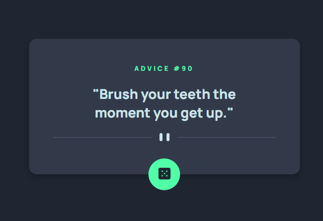
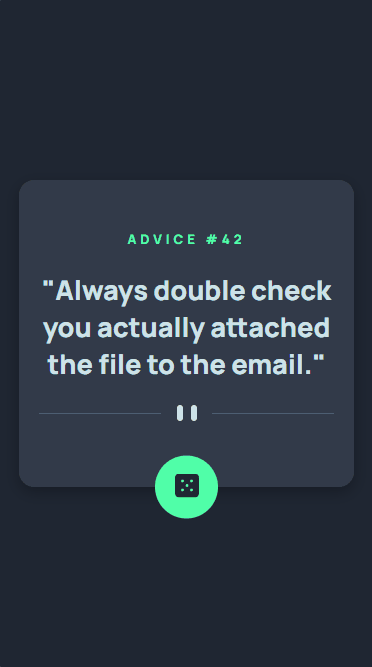

# Desafio do frontend mentor - Advice generator app

Esta é uma solução para o [Desafio Advice generator app do Frontend Mentor](https://www.frontendmentor.io/challenges/advice-generator-app-QdUG-13db).

## Índice

- [Visão geral](#visão-geral)
  - [Desafio](#desafio)
  - [Screenshot](#screenshot)
  - [Links](#links)
- [Meu processo](#meu-processo)
  - [Como usar](#como-usar)
  - [Tecnologias utilizadas](#tecnologias-utilizadas)
- [Autor](#autor)
- [Agradecimentos](#agradecimentos)

## Visão geral

### Desafio

- criar um layout próximo desse [Desafio Advice generator app do Frontend Mentor](https://www.frontendmentor.io/challenges/advice-generator-app-QdUG-13db). Onde o principal desafio é construir um aplicativo que gere conselhos aleatórios.
- gerar os conselhos aleatoriamente diretamente da API de conselhos quando o botão for clicado.

### Screenshot

#### Desktop

#### Mobile

### Links

- URL da página: [Advice generator app](https://alexjr53.github.io/advice-generator-app/) 
- solução do projeto no frontend mentor: [Advice generator app](https://www.frontendmentor.io/challenges/advice-generator-app-QdUG-13db/hub/advice-generator-app-IHleotSdde)

## Meu processo

### Como usar

- ao clicar no botão um novo conselho irá aparecer na tela.
- O conselho é armazenado em cache por 2  segundos. Qualquer solicitação de repetição dentro de 2 segundos retornará o mesmo conselho.

### Tecnologias utilizadas

- HTML
- CSS
- Javascript

## Autor
Alexsandro rosa junior

- GitHub - [Alexjr53](https://github.com/Alexjr53)

## Agradecimentos
Agradecimentos a equipe [Dev em Dobro](https://www.instagram.com/devemdobro/) que está me passando o conhecimento e conceitos necessários para poder realizar esses desafios.